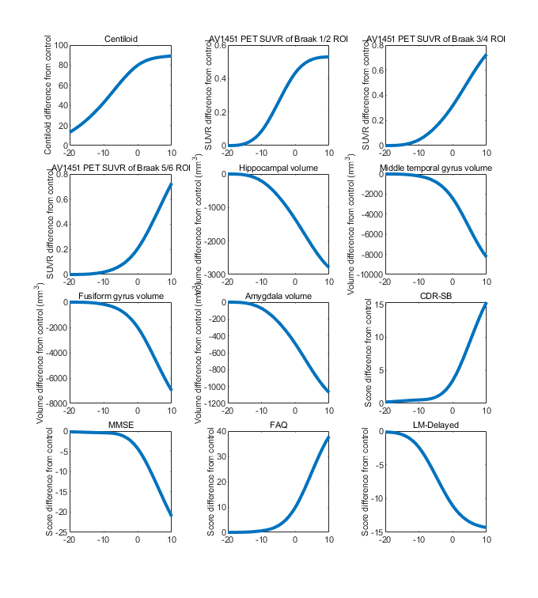
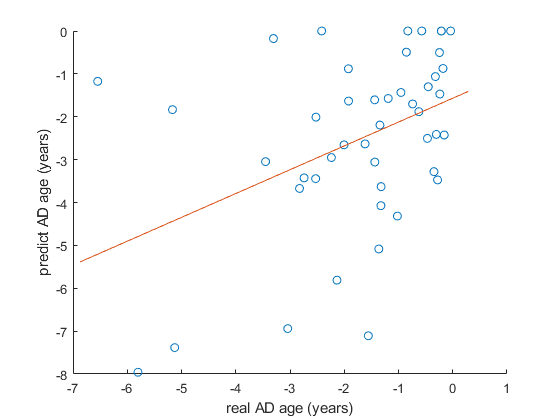

# MIST: Multimodal Integrated Spatiotemporal Trajectory Estimation

A MATLAB implementation of a non-parametric Expectation-Maximization (EM) algorithm for modeling Alzheimer's disease (AD) progression trajectories using longitudinal biomarker data.

## Overview

This framework jointly estimates subject-specific disease onset ages and population-level biomarker progression trajectories along a latent disease timeline. The method uses monotonic cubic B-spline functions with smoothness constraints to model how biomarkers evolve over the course of Alzheimer's disease.


## Core Methodology

### Model Framework

1. **Biomarker Trajectories**: Monotonic cubic B-spline functions of disease age with integrated squared second-derivative penalty for smoothness
2. **Demographic Effects**: Linear covariates regressed out from biomarker measurements
3. **Disease Onset Ages**: Subject-specific latent variables estimated iteratively
4. **Diagnosis Consistency**: Loss function that enforces agreement between estimated disease age and clinical diagnosis

### EM Algorithm

**E-step**: Update each subject's AD onset age by minimizing the objective function given current trajectory estimates

**M-step**: Estimate trajectory parameters, demographic coefficients, and CN-to-MCI transition point given updated onset ages

The procedure iterates until convergence.

## Main Functions

### `computeNonParaEMFixed`

Core EM algorithm for estimating disease progression trajectories.


### `computeROICurves`

ROI-level biomarker trajectory estimation with fixed disease ages.

### `UsingMultiFeaturesPredictADage`

Predict disease age for new subjects using a pretrained model.

## Usage Examples

### Example 1: Training the Model and Visualizing Trajectories

```matlab
% Train the model
[x, fval, ppcell_mu, stdY, ageonset, thetaMu, beta, t_cn_mci, ADage, ...
    e_cn, e_ad, D_ad, D_cn, Y_ad_diff, Y_cn_diff] = ...
    computeNonParaEMFixed(ptTable, hcTable, IDName, AgeName, DiagName, ...
    DemoNames, featureNames, isMRI, w, knots, lambda, rho);

% Visualize progression trajectories
figure
set(gcf, 'Units', 'centimeters', 'Position', [10 10 18 20]);

titleList = {'Centiloid', 'AV1451 PET SUVR of Braak 1/2 ROI', ...
    'AV1451 PET SUVR of Braak 3/4 ROI', 'AV1451 PET SUVR of Braak 5/6 ROI', ...
    'Hippocampal volume', 'Middle temporal gyrus volume', ...
    'Fusiform gyrus volume', 'Amygdala volume', ...
    'CDR-SB', 'MMSE', 'FAQ', 'LM-Delayed'};

YtitleList = {'Centilold difference from control', ...
    'SUVR difference from control', ...
    'SUVR difference from control', ...
    'SUVR difference from control', ...
    'Volume difference from control (mm^{3})', ...
    'Volume difference from control (mm^{3})', ...
    'Volume difference from control (mm^{3})', ...
    'Volume difference from control (mm^{3})', ...
    'Score difference from control', ...
    'Score difference from control', ...
    'Score difference from control', ...
    'Score difference from control'};

fea = 1:12;
for i = 1:length(fea)
    axi = nexttile;
    plot(axi, -20:10, fnval(ppcell_mu{i}, -20:10), ...
        'Color', [0 0.4470 0.7410], 'LineWidth', 3);
    title(axi, titleList{i}, 'Units', 'normalized', 'Position', [0.5, 1.01]);
    ylabel(axi, YtitleList{i});
    set(axi, 'FontSize', 6, 'FontName', 'Helvetica');
end

% Save the figure
saveas(gcf, 'biomarker_trajectories.png');
```

**Output:**



*Figure 1: Estimated progression trajectories for 12 biomarkers showing changes relative to disease age (years from dementia onset).*

### Example 2: ROI-Level Analysis and Visualization

```matlab
% Calculate ROI-level progression patterns
% Display patterns 5 years after dementia onset
t = 5;  % years after dementia onset

[ppcellROI_mu, cell_e_hc, cell_e_pt, cell_thetaMu, cell_beta, ...
    cell_ydif, monoROI, stdYROI] = ...
    computeROICurves(ROIptTable, ROIhcTable, isMRIROI, Xcolnames, ...
    DemoNames, ADage, knots, lambda);

% Compute Z-values for different modalities
minz = -0.5;
maxz = 1;

[MRIROIvalues, FBBROIvalues, AV45ROIvalues, AV1451ROIvalues] = ...
    computeADNITimeROIZvalue(ppcellROI_mu, cell_e_hc, ROIhcTable, ...
    newLabels, Xcolnames, t);

% Visualize on brain surfaces
drawTimeSurface(MRIROIvalues, CData, fv, mymap, minz, maxz, 'MRI_5.tif');
drawTimeSurface(AV45ROIvalues, CData, fv, mymap, minz, maxz, 'AV45_5.tif');
drawTimeSurface(FBBROIvalues, CData, fv, mymap, minz, maxz, 'FBB_5.tif');
drawTimeSurface(AV1451ROIvalues, CData, fv, mymap, minz, maxz, 'AV1451_5.tif');
```

**Output:**

<table>
<tr>
<td></td>
<td></td>
</tr>
<tr>
<td></td>
<td></td>
</tr>
</table>

*Figure 2: Brain surface maps showing regional biomarker changes 5 years after dementia onset for different imaging modalities.*

### Example 3: Predicting Disease Age from Cross-Sectional Data

```matlab
% Define MRI and cognitive features to use
MRIcogfeatureNum = [1:84, 253:256];

% Predict AD age using pretrained model
preTable_MRIcog = UsingMultiFeaturesPredictADage(MRIfeatureTable, ...
    [97:97+83, 269, 268, 271, 273], ...
    [{'AGE'}, {'GENDER'}, {'EDUC'}, {'E4'}, {'E2'}, {'ICV_Harm'}], ...
    "DIAGFULL", knots_model, XthetaMu_model(:, MRIcogfeatureNum), ...
    Xbeta_model(:, MRIcogfeatureNum), t_cn_mci_model, rho_model, ...
    [1/84*ones(1, 84), 1/4*ones(1, 4)], XstdY_model(MRIcogfeatureNum));

% Visualize predictions for MCI subjects
x = preTable_MRIcog(preTable_MRIcog.DIAGFULL == 2, :).ADage;
y = preTable_MRIcog(preTable_MRIcog.DIAGFULL == 2, :).predictADage;
indx = isnan(y);
x(indx) = []; 
y(indx) = [];

figure;
hold on
scatter(x, y);
[p, S] = polyfit(x, y, 1);
minx = min(x) - 0.05*(max(x) - min(x));
maxx = max(x) + 0.05*(max(x) - min(x));
X = [minx, maxx];
Y = [p(1)*minx + p(2), p(1)*maxx + p(2)];
plot(X, Y);
hold off
xlabel('True AD Age');
ylabel('Predicted AD Age');
title('AD Age Prediction Performance (MCI Subjects)');

% Save the figure
saveas(gcf, 'prediction_performance.png');
```

**Output:**



*Figure 3: Correlation between true and predicted disease age for MCI subjects using MRI and cognitive features.*

## Limitations

- Designed for monotonic progression patterns (Alzheimer's disease)
- Requires longitudinal data with clinical diagnosis information for training
- May not be suitable for other diseases without modification
- Assumes diagnosis codes follow the convention: 1=CN, 2=MCI, 3=Dementia


## Author

**Tianhao Zhang (Zhang Tianhao)**

## Contact

For questions or issues, please contact:
- thzhang@ihep.ac.cn
